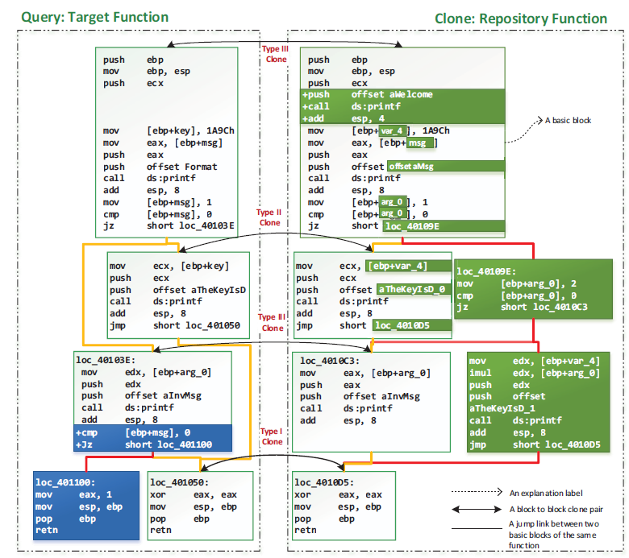

<h1>    What Is Kam1n0 v2? </h1>

 


**_Kam1n0 v2.x_** is a scalable assembly management and analysis platform. It allows a user to first index a (large) collection of binaries into different repositories and provide different analytic services such as clone search. It supports multi-tenancy access and management of assembly repositories by using the concept of **_Application_**. An application instance contains its own exclusive repository and provides a specialized analytic service. Considering the versatility of reverse engineering tasks, Kam1n0 v2.x server currently provides three different types of clone-search applications: **_Asm-Clone_**, **_Sym1n0_**, and **_Asm2Vec_**. New application type can be further added to the platform. 

<p align="center">
   
</p>

A user can create multiple application instances. An application instance can be shared among a specific group of users. The application repository read-write access and on-off status can be controlled by the application owner. Kam1n0 v2.x server can serve the applications concurrently using several shared resource pools. 


Kam1n0 was developed by [Steven H. H. Ding](http://stevending.net/) and [Miles Q. Li](http://milesqli.github.io/) under the supervision of [Benjamin C. M. Fung](http://dmas.lab.mcgill.ca/fung/) of the [Data Mining and Security Lab](http://dmas.lab.mcgill.ca/) at McGill University in Canada. It won the second prize at the [Hex-Rays Plug-In Contest 2015](https://hex-rays.com/contests/2015/). If you find Kam1n0 useful, please cite our paper:

* S. H. H. Ding, B. C. M. Fung, and P. Charland. [Kam1n0: MapReduce-based Assembly Clone Search for Reverse Engineering](https://drive.google.com/file/d/0BzRSjM7kjy-rZWUtRnFXR0ZpSjg/view?usp=sharing). In <i>Proceedings of the 22nd ACM SIGKDD International Conference on Knowledge Discovery and Data Mining (SIGKDD)</i>, pages 461-470, San Francisco, CA: ACM Press, August 2016.

* S. H. H. Ding, B. C. M. Fung, and P. Charland. Asm2Vec: boosting static representation robustness for binary clone search against code obfuscation and compiler optimization. In <i>Proceedings of the 40th IEEE Symposium on Security and Privacy (S&P)</i>, 18 pages, San Francisco, CA: IEEE Computer Society, May 2019.

## Asm-Clone

Asm-Clone applications try to solve the efficient subgraph search problem (i.e. graph isomorphism problem) for assembly functions (<1.3s average query time and <30ms average index time with 2.3M functions). Given a target function (the one on the left as shown below), it can identify the cloned subgraphs among other functions in the repository (the one on the right as shown below).

* Application Type: Asm-Clone
* The original clone search service used in Kam1n0 v1.x.
* Currently support Meta-PC, ARM, PowerPC, and TMS320c6 (experimental).
* Support subgraph clone search within a certain assembly code family.
  * \+ Good interpretability of the result: breaks down to subgraphs.
  * \+ Accurate for searching within the given code family.
  * \+ Good for differing various patches or versions for big binaries.
  * \- Relatively more sensitive to instruction set changes, optimizations, and obfuscation.
  * \- Need to pre-define the syntax of the assembly code language.
  * \- Need to have assembly code of the same chosen family in the repository.


<p align="center">
   
</p>


## Sym1n0

Semantic clone search by differentiated fuzz testing and constraint solving. An efficient and scalable dynamic-static hybrid approach (<1s average query time and <100ms average index time with 1.5M functions). Given a target function (the one on the left as shown below), it can identify the cloned subgraphs among other functions in the repository (the one on the right as shown below). Support visualization of abstract syntax graph.
* Application Type: Sym1n0 (v2 only)
* Clone search by both symbolic execution and concrete execution. 
* Differentiate functions based on their different I/O behavior.
* Clone search conducted on the abstract syntax graph constructed from Vex IR (powered by LibVex). 
  * \+ Clone search across different assembly code families.
    * For example, indexed x86 binaries but the query is ARM code. 
  * \+ Subgraph clone search.
  * \+ Support a wide range of families throub LibVex.
    * x86, AMD64, MIPS32, MIPS64, PowerPC32, PowerPC64, ARM32, and ARM64.
  * \+ An efficient dynamic-static hybrid approach.
  * \+ Ideal for analyzing firmware compiled for different processors.
  * \- Sensitive to heavy graph manipulation (such as a full flattening).
  * \- Sensitive to large scale breakdown of basic block integrity. 


<p align="center">
   
</p>


## Ams2Vec

Asm2Vec leverages representation learning. It understands the lexical semantic relationship of assembly code. For example, `xmm*` registers are semantically related to vector operations such as `addps`. `memcpy` is similar to `strcpy`. The graph below shows different assembly functions compiled from the same source code of `gmpz_tdiv_r_2exp` in libgmp. From left to right, the assembly functions are compiled with GCC O0 option, GCC O3 option, O-LLVM obfuscator Control Flow Graph, Flattening option, and LLVM obfuscator Bogus Control Flow Graph option. Asm2Vec can **_statically_** identify them as clones.

* Leverage representation learning.
* Understand the lexical semantic relationship of assembly code.
  * \+ State-of-the-art for clone search against heavy code obfuscation techniques.
    * (>0.8 accuracy for all options applied in O-LLVM, multiple iterations).
  * \+ State-of-the-art for clone search against code optimization.
    * (>0.8 accuracy between O0 and O3, >0.94 accuracy between O2 and O3)
  * \+ Even better result than the most recent dynamic approach.
  * \+ Much more efficient than recent dynamic approaches. 
  * \+ Do not need to define the architecture. It self-learns by reading large volume of code.
  * \+ Static approach: efficient and scalable.
  * \- No subgraphs.
  * \- Assume the assembly code come from the same processor family.
  * \- Static approach: cannot recognize jump table, etc.


<p align="center">
   
</p>

## Platform Overview

The figure below shows the major UI components and functionalities of Kam1n0 v2.x. We adopt a material design. In general, each user has an application list, a running-job list, and a result file list. 
* Application list shows the application instances owned by the user and shared by the others. 
* Running-job list shows the running progress for a large query (such as chrome.dll) and indexing procedure.
* Result file list displays the saved results. 
More details of the UI design can be found in our detailed [tutorial](#documentation). 

<p align="center">
   
</p>


#  Installation Instruction

The current release of Kam1n0 consists of two installers: the core server and IDA Pro plug-in. 

<table>
  <tr>
    <th>Installer</th>
    <th>Included components</th>
    <th>Description</th>
  </tr>
  <tr>
    <td rowspan="4">Kam1n0-Server.msi</td>
     <td>Core engine</td>
     <td>Main engine providing service for indexing and searching.</td>
  </tr>
   <tr>
      <td>Workbench</td>
     <td>A user interface to manage the repositories and running service.</td>
  </tr>
 <tr>
      <td>Web user interface</td>
     <td>Web user interface for searching/indexing binary files and assembly functions.</td>
  </tr>
  <tr>
     <td>Visual C++ redistributable for VS 15</td>
     <td>Dependecy for z3.</td>
  </tr>
  <tr>
    <td rowspan="3">Kam1n0-IDA-Plugin.msi</td>
     <td>Plug-in</td>
     <td>Connectors and user interface.</td>
  </tr>
<tr>
     <td>PyPI wheels for Cefpython</td>
     <td>Rendering engine for the user interface.</td>
  </tr>
   <tr>
     <td>PyPI and dependent wheels</td>
     <td>Package management for Python. Included for IDA 6.8 &6.9. </td>
  </tr>
</table>

## Installing the Kam1n0 Server

The Kam1n0 core engine is purely written in Java. You need the following dependencies:

* [Required] The latest x64 8.x JRE/JDK distribution from [Oracle](http://www.oracle.com/technetwork/java/javase/downloads/index.html).
  * Java9 and Java10 are not supported at this moment.
* [Optional] The latest version of IDA Pro with the [idapython](https://github.com/idapython/src/) plug-in installed. The Python plug-in and runtime should have already been installed with IDA Pro. Reinstall IDA Pro if necessary. 

Download the ```Kam1n0-Server.msi``` file from our [release page](https://github.com/McGill-DMaS/Kam1n0-Plugin-IDA-Pro/releases). Follow the instructions to install the server. You will be prompted to select an installation path. IDA Pro is optional if the server does not have to deal with any disassembling. In other words, the client side  uses the Kam1n0 plugin for IDA Pro. It is strongly suggested to have the IDA Pro installed with the Kam1n0 server. Kam1n0 server will automatically detect your IDA Pro by looking for the default application that you used to open `.i64` file.

## Installing the IDA Pro Plug-in

The Kam1n0 IDA Pro plug-in is written in Python for the logic and in HTML/JavaScript for the rendering. The following dependencies are required for its installation:

* [Required] IDA Pro (>6.7) with the [idapython](https://github.com/idapython/src/) plug-in installed. The Python plug-in and runtime should have already been installed with IDA Pro. Reinstall IDA Pro if necessary. 


Next, download the ```Kam1n0-IDA-Plugin.msi``` installer from our [release page](https://github.com/McGill-DMaS/Kam1n0-Plugin-IDA-Pro/releases). Follow the instructions to install the plug-in and runtime. Please note that the plug-in has to be installed in the IDA Pro plugins folder which is located at ```$IDA_PRO_PATH$/plugins```. For example, on Windows, the path could be ```C:/Program Files (x86)/IDA 6.95/plugins```. The installer will detect and validate the path. 

## Backward Compatibility

The assembly code repositories and configuration files used in previous versions (<2.0.0) are no longer supported by the latest version. Please contact us if you need to migrate your old repositories.

## Installing Kam1n0 on Linux

`*.tar.gz` binaries are built for Linux. You will need to untar the files in `Kam1n0-IDA-Plugin.tar.gz` to your IDA plugin folder. You can run `workbench.jar` to start the Kam1n0 server on Linux. However, Linux binaries are experimental and are not covered by our test cases.

# Documentation
* [Kam1n0 Server Tutorial](documentation/server/server.md#tutorial)
  * [Configuration and Engine Startup](documentation/server/server.md#edit-and-start-engine)
  * [Register an account and login](documentation/server/server.md#register-an-account-and-login)
  * [Create an application](documentation/server/server.md#create-an-app)
  * [Application Sharing and Access Control](documentation/server/server.md#share-an-app)
  * [Preparing the data](documentation/server/server.md#preparing-the-data)
  * [The application URL for IDA Pro Plugin](documentation/server/server.md#get-the-url-for-ida-pro-plugin)
  * [Index binary files](documentation/server/server.md#index-binary-files)
  * [Search with an assembly function](documentation/server/server.md#search-with-an-assembly-function)
    * [Flow graph view](documentation/server/server.md#flow-graph-view)
    * [Text diff view](documentation/server/server.md#text-diff-view)
    * [Clone group view](documentation/server/server.md#clone-group-view)
  * [Search with a binary file](documentation/server/server.md#search-with-a-binary-file)
  * [Browse a clone search result](documentation/server/server.md#browse-a-clone-search-result)
    * [The summary boxes](documentation/server/server.md#the-summary-boxes)
    * [Details](documentation/server/server.md#details)
* [IDA Pro Plug-in Tutorial](documentation/ida-pro-plugin/ida-pro-plugin.md#tutorial)
  * [Functionalities](documentation/ida-pro-plugin/ida-pro-plugin.md#functionalities)
  * [Walk through example](documentation/ida-pro-plugin/ida-pro-plugin.md#walk-through-example)
    * [Preparing the data](documentation/ida-pro-plugin/ida-pro-plugin.md#preparing-the-data)
    * [Engine startup and application URL](documentation/ida-pro-plugin/ida-pro-plugin.md#start-the-engine-and-get-the-url-for-ida-pro-plugin)
    * [Connection configuration](documentation/ida-pro-plugin/ida-pro-plugin.md#set-up-connection)
    * [Indexing from plug-in](documentation/ida-pro-plugin/ida-pro-plugin.md#indexing)
    * [Functions search](documentation/ida-pro-plugin/ida-pro-plugin.md#functions-search)
    * [Composition analysis](documentation/ida-pro-plugin/ida-pro-plugin.md#composition-analysis)
    * [Assembly fragment search](documentation/ida-pro-plugin/ida-pro-plugin.md#assembly-fragment-search)
    * [Search box](documentation/ida-pro-plugin/ida-pro-plugin.md#search-box)
  * [How does the Plugin Work](documentation/ida-pro-plugin/ida-pro-plugin.md#how-does-the-plug-in-work)
    * [User Interface](documentation/ida-pro-plugin/ida-pro-plugin.md#user-interface)
    * [Synchronization](documentation/ida-pro-plugin/ida-pro-plugin.md#synchronization)
    * [Two-way Communication](documentation/ida-pro-plugin/ida-pro-plugin.md#communication)
    
# Development
Clone the latest stable branch (don't forget `--recursive`!):
```bash
git clone --recursive -b master2.x --single-branch https://github.com/McGill-DMaS/Kam1n0-Community
```

## Importing the project.
IntelliJ: Import the root /kam1n0/kam1n0/ as a maven project. All the submodules will be loaded accordingly.
EclipseEE: Add the cloned git repository to the git view. Import all maven projects from the git repository.
You may need to modify the classpath to address any error. 
All the resources path are dynamically modified when running inside an IDE 
(through the kam1n0-resources submodule).

To build the project:
```
cd /kam1n0/kam1n0
mvn -DskipTests clean package
mvn -DskipTests package
```
The resulting binaries can be found in /kam1n0/build-bins/

To run the test code, you will need to first download `chromedriver.exe` from http://chromedriver.chromium.org/ and add its *absolute* path into an environment variable named `webdriver.chrome.driver`. It is also required that there is a chrome browser installed in the system. The test code will launch a browser instance to test the UI interfaces. The complete testing procedure will take approximately 3 hours. 

```
cd /kam1n0/kam1n0
mvn -DskipTests clean package # you can skip this one if you already built the package
mvn -DskipTests package       # you can skip this one if you already built the package
mvn -DforkMode=never test
```

These commands only compiles java with pre-compiled wheels of libvex and z3. It works out-of-the-box.
The build of libvex and z3 is platform-dependent. We use a fork of libvex from Angr. 
More serious build scripts as well as installers for windows/linux can be found under /kam1n0-builds/

* kam1n0: The server's source code.
* kam1n0-builds: Installer source code and scripts to build the distribution. 
* kam1n0-clients: The clients' source code. 

## Binary Releases

We have a Jenkin server for contineous development and delivery. Latest stable release will be posted here. Periodically we will synchronize our internal experimental branch with this repository. 


## Licensing

The software was developed by [Steven H. H. Ding](http://stevending.net/) and [Miles Q. Li](http://milesqli.github.io/) under the supervision of [Benjamin C. M. Fung](http://dmas.lab.mcgill.ca/fung/) in the Data Mining and Security Lab at McGill University, Canada. It is distributed under the Apache License Version 2.0. Please refer to [LICENSE.txt](LICENSE.txt) for details.

Copyright 2018 McGill University. 
All rights reserved.

## Acknowledgement

-orange.svg?style=for-the-badge)


