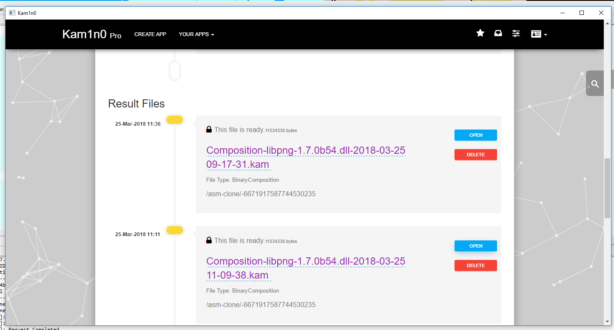

# IDA Pro Plug-in v2.0 Tutorial

* [IDA Pro Plug-in Tutorial](#tutorial)
  * [Functionalities](#functionalities)
  * [Walk through example](#walk-through-example)

    * [Preparing the data](#preparing-the-data)
    * [Start the engine and get the URL for IDA Pro Plugin](#start-the-engine-and-get-the-URL-for-IDA-Pro-Plugin)
    * [Set up connection](#set-up-connection)
    * [Indexing](#indexing)
    * [Functions Search](#functions-search)
    * [Composition analysis](#composition-analysis)
    * [Assembly fragment search](assembly-fragment-search)
    * [Search box](search-box)
  * [How does the Plugin Work](#how-does-the-plug-in-work)
    * [User Interface](#user-interface)
    * [Synchronization](#synchronization)
    * [Communication](#communication)

The IDA Pro plug-in for Kam1n0 v2.0 creates a folder ```~/Kam1n0/``` to store the plug-in data and errors.
This tutorial first introduces IDA Pro plug-in for Kam1n0 v2.0's basic functionalities and then goes through a simple index and search example.

## Functionalities
The Kam1n0  v2.0 engine with the plug-in provides the functionalities to index and search assembly functions.

Icon | Functionality | Description | Hot key
----------|---------------- | -------------------- | -----------
| Search current function | Search the function at current address | Ctrl+Shift+S
| Select functions to search | Select functions to search | Ctrl+Shift+A
| Index current function | Index the function at current address | Ctrl+Shift+K
| Select functions to index | Select functions to index | Ctrl+Shift+J
| Manage connections | Manage connections to different repositories | NA
 | Manage storage | Mange local/remote accounts and storage | NA
 | Fragment search (new) | Search with the selected assembly fragment | NA

These functionalities can be found in the:

* IDA Pro Search Toolbar:  

     

* IDA Pro Functions Window:

     


* IDA Pro Search Menu:

     


* IDA Pro Edit Menu:

     

* IDA Pro View A (popup menu):

     


Even though you can select functions from the popup menu of the ```IDA Pro Functions Window``` to search/index functions, using  and  at other places (e.g. toolbar) opens a ```Selection Window``` which provides a more detailed configuration for multiple search.


For example, you can apply different filters and choose which connection you want to use to search/index them.

## Walk through example
Let's go through a simple index and search case using the engine and plugin.

### Preparing the data
Suppose we have two binary files ```libpng-1.7.0b54.dll``` from libpng and  ```zlib-1.2.7.dll``` from zlib. These two files are included in our release file ```Example.zip```. We suggest you to try them first as to be consistent with the following descriptions. You may index other binary files later as you wish. We try to index the first binary file ```libpng-1.7.0b54.dll``` and search the second one ```zlib-1.2.7.dll``` against it.

### Start the engine and get the URL for IDA Pro Plugin

In this step, you should start the Kam1n0 engine and get the URL for IDA Pro Plugin from the homepage of the APP you want to use.


### Set up connection
Open IDA Pro and click on the ```Manage Connection Button``` in the toolbar . You are now able to review and edit the connections of the plug-in. Fill the URL for IDA Pro Plugin, username, password in the form and then click ```Update/Add Button``` and ```OK```.  


### Indexing

To index only some functions, click on the ```Select Functions to Index Button``` in the toolbar (or in the other aforementioned location). Select the functions you want to index and click the ```Continue Button```. Each indexed binary is uniquely identified by its path, and each indexed function by its binary ID and starting address.


An embedded chromium browser will pop up and show the progress of indexing. It has the same set of UI as Kam1n0 Web interface. You can leave the page or monitor the progress with it.


### Functions Search
Open IDA Pro and disassemble the target ```zlib-1.2.7.dll``` binary file as usual. Click on the ```Select Functions to Search Button``` in the toolbar . Suppose we want to search for the ```alder32``` and ```compress2``` functions. Select them using ctrl+click in the list. Click on the ```Continue Button```.


An embedded chromium browser will pop up and show the progress of searching and it will be redirected to the result page after it completes. Similar to Kam1n0 Web UI, for each retrieved function, you can see the similarity, flow graph comparison, full text alignment, clone group alignment by clicking the corresponding icon. You can also see the clone graph by clicking the it from the right side. It has the same set of UI as Kam1n0 Web interface except we have an additional flow graph linking function here.


The user can jump from a basic box in the clone search result rendering views to the corresponding basic block in IDA View-A. This functionality is available in both the Clone List View and any Flow Graph View.


In any Flow Graph related view, if you double-click a specific basic block in the graph, the IDA View-A will jump to the same basic block either in the text or in a graph. In all the clone list view, if you right-click context menu to the query nodes in the tree, you can see the option jumping to the corresponding assembly function in IDA View-A.


### Composition analysis

 To search all the functions of the binary file and keep the result in a file which will be shown on your homepage of server, click on the ```Composition Analysis``` in the toolbar . An embedded chromium browser will pop up and show the progress of analysis. You can leave the page or monitor the progress with it.


You can find the result of composition analysis later from your homepage in the same way as you use Web UI to do it.




### Assembly fragment search


Starting from version 1.x.x, we support assembly fragment search in IDA Pro. You can simply select a couple lines of assembly code and right click on it to pop out the menu. Select the entry `Query fragment`. An embedded chromium browser will pop up and show the progress of searching and it will be redirected to the result page after it completes. The result page is similar to the result of functions search.


### Search box

There is a search box to help you quickly locate the wanted information on the web pages of the embedded chromium browser. The search box is hidden on the right edge of every web page. It can be activated and slides out if the user press control+F or click the search icon. After typing the keyword to be searched and pressing the key Enter, one can loop through the search results on the web page. By pressing ESC key, one will clear the search text box as well as all the highlighted search results.


# How does the Plug-in Work

The plug-in is written in Python using ```idaapi```. The root of this repository is the Windows installer. The source code of the plug-in can be found [here](images/https://github.com/McGill-DMaS/Kam1n0-Plugin-IDA-Pro/tree/master/Kam1n0WinSetupProject/bin_release/plugins).

## User Interface

The user interface consists of two parts:
* The native ```idaapi``` forms and controls: the Connection Management Form, the Search Progress Form, the Index Progress Form, the Select Function to Search Form, and the Select Function to Index Form.
* The local webpages: the Clone Graph View, the Clone List View, the Text-Diff View, the Flow View, and the Clones View. These local webpages are rendered using the embeded Chromium shipped with cefpython, and the frame used to hold Chromium is wxpython. We tried cefpython with the build-in pyside of IDA Pro. Unfortunately, pages cannot be rendered, so we switch to wxpython.

## Synchronization

We find it difficult to update the IDA Pro UI asynchronously using ```idaapi```. If a thread other than the main thread updates the interface while the user interacts with (e.g. clicks on) the interface, IDA Pro will freeze/crash.

## Communication

To interact with the Kam1n0 web services, we use the built-in ```urllib``` in Python to send requests and the ```json``` lib to parse the json results. After that, the json results are passed to javascripts using ```cefpython```.
