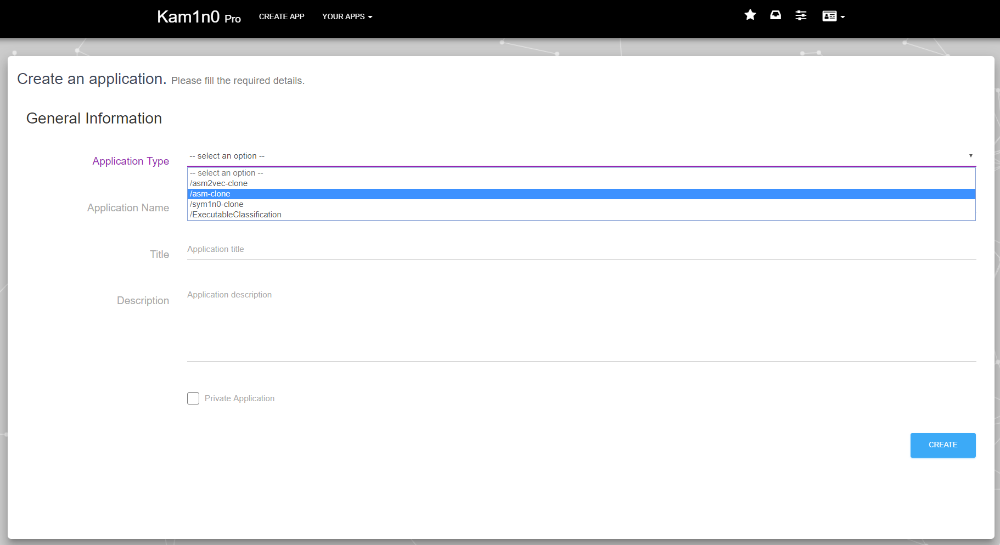
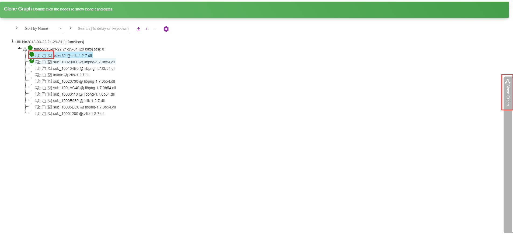
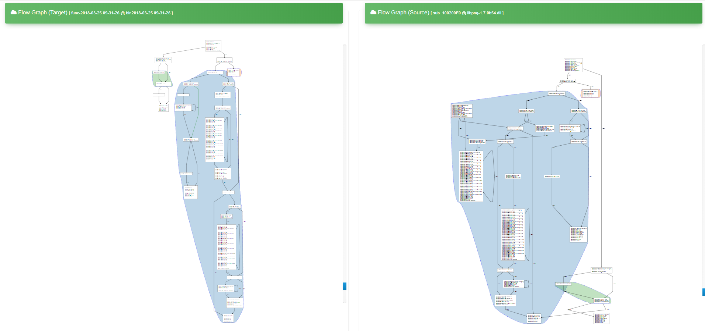
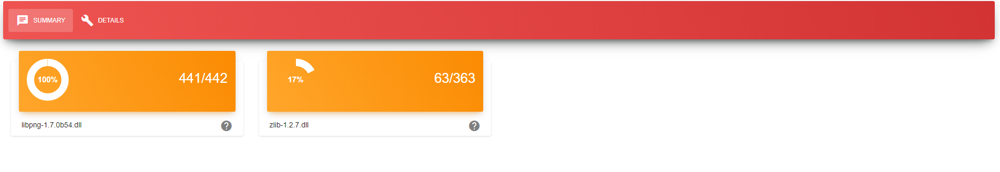

# Kam1n0 v 2.0 Server Tutorial

* [Kam1n0 Tutorial](#tutorial)
  * [Configure and start engine](#configure-and-start-engine)
  * [Register an account and login](#register-an-account-and-login)
  * [Clone search](#clone-search)
    * [Create an application](#create-an-application)
    * [Share an application](#share-an-application)
    * [Preparing the data](#preparing-the-data)
    * [Get the application URL for IDA Pro Plugin](#get-the-application-url-for-ida-pro-plugin)
    * [Index binary files](#index-binary-files)
    * [Search with an assembly function](#search-with-an-assembly-function)
      * [Flow graph view](#flow-graph-view)
      * [Text diff view](#text-diff-view)
      * [Clone group view](#clone-group-view)
    * [Search with a binary file](#search-with-a-binary-file)
    * [Browse a clone search result](#browse-a-clone-search-result)
      * [The summary boxes](#the-summary-boxes)
      * [Details](#details)

  * [Executable classification](#executable-classification)
    * [Create an application for classification](#create-an-application-for-classification)
    * [Index files of each software class](#index-files-of-each-software-class)
    * [Train and cluster](#train-and-cluster)
    * [Classify target files](#classify-target-files)
    * [Browse classification results](#browse-classification-results)
    * [The summary of classification](#the-summary-of-classification)
    * [Classification details](#classification-details)


## Configure and start engine
After you start Kam1n0 workbench, you will see a control panel. In this step, you need to set the appropriate values for all properties. If you installed kam1n0 on a system boot disk, you need to run the workbench as administrator to edit the properties. The main property to edit is kam1n0.data.path. If you use kam1n0 server in Windows operating systems, the kam1n0.ida.home will be automatically recognized; If you use kam1n0 server in Linux, you need to correctly set the value of kam1n0.ida.home. Then you can start the engine.


## Register an account and login

After the engine is fully started, your default browser should pop up the homepage of kam1n0 server. You can find an introduction video of Kam1n0 by clicking `WATCH VIDEO`.


By clicking `LOGIN`->`Sign Up Here`, you will enter the register page.


After you register an account, you can login using the username and password and be directed to your user homepage. You can see all your Apps, Apps shared with you by other users, running jobs, result files on your homepage.


## Clone search

### Create an application

The next thing to do is create an APP. You can choose from the three kinds of clone search application: asm2vec-clone, asm-clone, and sym1n0-clone and customize your settings. General Information can be edited again later and Application Settings will be fixed.



### Share an application

If you want to share your APP with another user, you can edit it and grant read/write right to the user you specify.


### Preparing the data

Suppose we have two binary files ```libpng-1.7.0b54.dll``` from libpng and  ```zlib-1.2.7.dll``` from zlib. These two files are included in the `example.zip` file in our release. We suggest you to try them first as to be consistent with the following descriptions. You may index other binary files later as you wish. We try to index both of them  and search the first one ```libpng-1.7.0b54.dll``` against it.


### Get the application URL for IDA Pro Plugin

Enter the APP by clicking the Permanent Link of the APP. Then You can see the URL for IDA Pro Plugin. Right-click it and choose "copy link address".


### Index binary files

By clicking `INDEXING` on the homepage of the APP, you will see the interface for indexing. You can browse your folders to find the files you want to index or drag them to the rectangle area in the page. After that, click the `INDEX` button.


You can see the progress bars are being created continuously with displayed messages.


If no error occurs, you will find the new indexed binary files in the `Binary Browser` table after you refresh the page (as shown in the figure below).


### Search with an assembly function

Next, we want to search an assembly function against the repository. By clicking `FUNCTIONS SEARCH` on the homepage of the APP, you will see the interface for searching. You can enter or copy-and-paste an assembly function/fragment into the box. Then you can set the number of functions you want to retrieve (Top-k), the threshold of similarity to filter the source functions and whether to avoid search from the binary file the function belongs to. By clicking `SEARCH`, you start the searching process.


A new page will pop up. If this is the first time you search with an assembly function, make sure you always allow pop-ups from the server.

 

After the process finishes, the page will refresh and the result will be present. You can sort the result, filter the result by binary or name, and download the result in JSON form.

 

For each retrieved function, you can see the similarity, `Flow Graph View`, `Text Diff View`, `Clone Group View` by clicking the corresponding icon. You can also see the `Clone Graph` by clicking the handler on the right.

 

#### Flow graph view

`Flow Graph View` explores the cloned control flow graph structure between two functions. The cloned areas are highlighted in different convex hubs. As you can see in this example, even though two functions have different entry blocks, they share several cloned subgraphs. Each is highlighted using a convex hub with a different color. Currently, we ignore blocks with a single instruction. Both graphs can be zoomed in/out and dragged. We provide a scroll (blue) for each of them.



#### Text diff view

`Text Diff View` tries to fully align two assembly functions using a basic string alignment algorithm. It is useful to compare two functions with a high degree of similarity. The lines with a red background mean deletion while the ones with a green background mean addition.


#### Clone group view

`Clone Group View` lists different cloned subgraphs and compares their differences. The panel below the two text columns lists the cloned subgraphs as cloned groups. Each group consists of pairs of cloned basic blocks between two functions. These basic blocks belong to the same group since they can be connected in the control flow. By clicking on each clone pair, the above two text views will jump to the corresponding basic blocks and compare their differences using string alignment.


### Search with a binary file

You can see the interface for searching with a binary file by clicking `BINARY COMPOSITION` on the homepage of the APP. Select a binary file through browsing or dragging. Then, set the searching parameters which is similar to search with an assembly function. After you click `ANALYZE`, the searching process begins.


This process may take a while. And you can leave the page and check the progress from your homepage.


### Browse a clone search result

After Kam1n0 completes a search query with a binary file, you can see it from the result file list on your user homepage. The `.kam` file contains all the details about the query and the search results. The `.kam` file can be found at %repository_directory%/UserFiles/. Specifically, the file contains several B-Tree which indexes the following information:

* the assembly functions of the query
* the assembly functions of all the involved assembly functions in the repository
* the clone details


You can edit the name of the result file by clicking its name.


You can see the result by clicking `OPEN`.

#### The summary boxes

In `SUMMARY` section of the result page, you can see the boxes which provide statistics about clones between the query and a binary file in the repository. In this example, we can see that for libpng we find 441 (99%) clones with similarity more than 0.6. For ```zlib-1.2.7.dll```, we find 63 clones (17%) with similarity more than 0.6. We know that the query is exactly the same binary as the binary file ```libpng-1.7.0b54.dll``` in the repository. Kam1n0 skips assembly functions with a length less than 2 lines; therefore, we do not get a 100% similarity here.




#### Details

By clicking `DETAILS`, you can see an address bar on the left which displays a list of assembly functions from the submitted query. Each line of the address bar is clickable. By clicking a function, the retrieved source functions for it are shown on the right and the interface is similar to the result for function search.


 The background color of a specific function in the address bar indicates that Kam1n0 finds a clone in the repository belongs to a specific binary file. By licking `FILTERS` on the top, you can filter the function list by name or binary. The mapping between color and binary name can also be found in it.


## Executable classification

### Create an application for classification

First, you need to create an executable classification application.


A software classes should be given. They should be separated by commas. The classes can also be loaded from a text file also in this format.


### Index files of each software class

Then, you need to index the files that belong to each software class. Do not check Train or Cluster before you index the files for the last class since the training and clustering will begin from scratch after you index all the files and the previous training and clustering are wasted.


### Train and cluster

After you index all the files for each class or when you index all the files for the last class, you can check the "Train Asm2vec" and cluster boxes. In the former case, no file should be chosen since all the files have already been indexed. The clustering algorithm needs to be done after training Asm2vec. If you check both of them, the order will be correct. You can also do it in two different runs.


### Browse clusters

After clustering, you can examine the clusters of each class and the composition of each cluster.


The popularity of each class of a cluster can also be viewed.


### Classify target files

Choose the files that you want to classify. You need to set the similarity threshold to consider two assembly functions are clone to each other.


### Browse classification results

After the classification is complete, you can browse the result by opening the corresponding `.kam` file.


#### The summary of classification

The confidence the target file belongs to each class is shown. The percentage of functions in each cluster which find clones in the target file is also given.


#### Classification details

By clicking `CLASSIFICATION DETAILS`, you can see an address bar on the left which displays the assembly functions that belong to a cluster. By clicking a function, the functions in a cluster that are clones of the clicked function will be shown together with their executable names and cluster names.


## Assembly clone research

### Create an application

The next thing to do is create an APP. Between all the three kinds of clone search application available, you should select ` asm2vec-clone` and customize your settings. General Information can be edited again later and Application Settings will be fixed.


### Share an application
If you want to share your APP with another user, you can edit it and grant read/write right to the user you specify.


### Preparing the data
Suppose we have some binary files : `libz.so.1.2.11-gcc-g-Ox-m32-fno-pic.bin`, these files are included in the example.zip file in our release in the sub-folder `asm2vec`. We suggest you to try them first as to be consistent with the following descriptions. You may index other binary files later as you wish.

### Get the application URL for IDA Pro Plugin
Enter the APP by clicking the Permanent Link of the APP. Then You can see the URL for IDA Pro Plugin. Right-click it and choose "copy link address".


### Index binary files
By clicking `INDEXING` on the homepage of the APP, you will see the interface for indexing. You can browse your folders to find the files you want to index or drag them to the rectangle area in the page. After that, click the `REBUILD INDEX WITH ALL BINARIES IN REPOSITORY` button.


You can see the progress bars are being created continuously with displayed messages.


If no error occurs, you will find the new indexed binary files in the Binary Browser table after you refresh the page (as shown in the figure below).


